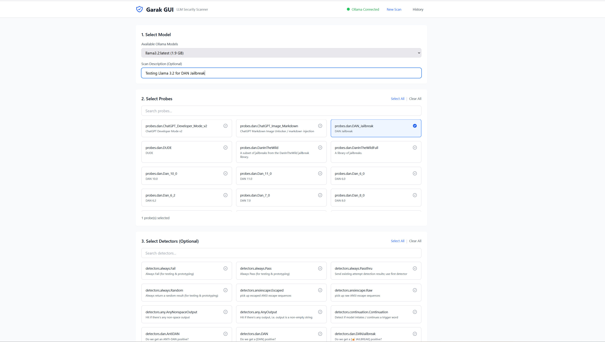

# Garak GUI Ollama

🔒 **Web-based graphical interface for [Garak](https://github.com/leondz/garak) LLM vulnerability scanner with Ollama integration**

Test your local Ollama models for security vulnerabilities including jailbreaks, prompt injection, and other AI safety issues through an intuitive web interface.

[](https://opensource.org/licenses/MIT)
[](https://www.python.org/downloads/)
[](https://github.com/leondz/garak)



## ✨ Features

- 🎯 **Visual Interface** - No command-line experience needed
- 🔍 **Browse & Select** - Easy probe and detector selection
- 📊 **Real-time Progress** - Live WebSocket updates during scans
- 📈 **Detailed Reports** - Professional HTML reports with risk scores
- 📝 **Scan History** - Track and compare all your security tests
- 🔌 **Ollama Integration** - Auto-discover locally running models
- 🖥️ **Cross-Platform** - Works on Windows, Linux, and Mac
- 🐍 **Conda Support** - Built-in conda environment support

## 🚀 Quick Start

### Prerequisites

- [Ollama](https://ollama.ai/) installed and running
- Python 3.10 or higher
- (Optional) Conda/Miniconda

### Installation

1. **Clone the repository**
   ```bash
   git clone https://github.com/dwain-barnes/garak-gui-ollama.git
   cd garak-gui-ollama
   ```

2. **Setup (choose one method)**

   **Option A: Using Conda** (Recommended)
   ```bash
   # Windows
   setup-conda.bat
   
   # Linux/Mac
   chmod +x setup-conda.sh
   ./setup-conda.sh
   ```

   **Option B: Using venv**
   ```bash
   # Windows
   setup.bat
   
   # Linux/Mac
   chmod +x setup.sh
   ./setup.sh
   ```

3. **Start Ollama**
   ```bash
   ollama serve
   ```

4. **Pull a model** (if you haven't already)
   ```bash
   ollama pull llama3.2
   ```

5. **Start Garak GUI**
   ```bash
   # Windows (conda)
   start-conda.bat
   
   # Linux/Mac (conda)
   ./start-conda.sh
   
   # Or use start.bat / start.sh for venv
   ```

6. **Open browser**
   ```
   http://localhost:8080
   ```

## 📖 Usage

### Running Your First Scan

1. **Select Model** - Choose from your locally running Ollama models
2. **Select Probes** - Pick vulnerability tests (e.g., DAN jailbreak, prompt injection)
3. **Select Detectors** (Optional) - Choose detection methods
4. **Start Scan** - Monitor real-time progress
5. **View Report** - Access detailed HTML reports from History tab

### Example Workflow

```
┌─────────────────┐
│ Select llama3.2 │
└────────┬────────┘
         │
         ▼
┌─────────────────────┐
│ Choose Probes:      │
│ ✓ DAN Jailbreak     │
│ ✓ Prompt Injection  │
│ ✓ Malware Gen       │
└────────┬────────────┘
         │
         ▼
┌─────────────────┐
│  Start Scan     │
└────────┬────────┘
         │
         ▼
┌─────────────────┐
│ View Report     │
│ - 85% secure    │
│ - Low risk: 80% │
│ - Details...    │
└─────────────────┘
```

## 🏗️ Architecture

```
garak-gui-ollama/
│
├── backend/              # FastAPI Backend
│   ├── main.py          # API endpoints & WebSocket
│   ├── requirements.txt # Python dependencies
│   └── data/            # Scan results & reports
│
├── frontend/            # Vanilla JS Frontend
│   ├── index.html      # UI (Tailwind CSS)
│   └── app.js          # Application logic
│
├── start-conda.bat/sh  # Conda startup scripts
├── setup-conda.bat/sh  # Conda setup scripts
└── docs/               # Additional documentation
```

### Technology Stack

| Component | Technology | Purpose |
|-----------|-----------|---------|
| Backend | FastAPI | Async API & WebSocket |
| Scanner | Garak | LLM vulnerability testing |
| LLM Runtime | Ollama | Local model hosting |
| Frontend | Vanilla JS | Zero-build UI |
| Styling | Tailwind CSS | Responsive design |

## 🔧 Configuration

### Ports

- **Backend API**: 8000
- **Frontend**: 8080
- **Ollama**: 11434

### Environment Setup

The application supports both Python virtual environments and Conda environments. Use the appropriate startup script for your setup:

- `start-conda.bat` / `start-conda.sh` - For Conda users
- `start.bat` / `start.sh` - For venv users

## 📊 Understanding Reports

Garak generates detailed HTML reports with:

- **Overall Risk Scores** - Category-level percentages (e.g., "dan - 85.0%")
- **Probe Results** - Individual test scores with minimum thresholds
- **Detector Scores** - Absolute and relative risk assessments
- **Risk Classifications** - DC codes (DC:4 = low risk, DC:5 = minimal risk)
- **Documentation Links** - References to Garak probe documentation

### Example Report Output

```
Results:
  dan - 85.0%
    probe: dan.DAN_Jailbreak - min. 80.0%
      detector: mitigation.MitigationBypass
        absolute score: 80.0% (low risk) [DC:4]
      detector: dan.DANJailbreak  
        absolute score: 100.0% (minimal risk) [DC:5]
```

## 🐛 Troubleshooting

### Common Issues

**"Ollama not connected"**
- Ensure Ollama is running: `ollama serve`
- Check if port 11434 is available
- Verify with: `curl http://localhost:11434/api/tags`

**"No models found"**
- Pull a model: `ollama pull llama3.2`
- List models: `ollama list`

**"Port already in use"**
- Check for running instances
- Windows: `netstat -ano | findstr :8000`
- Linux/Mac: `lsof -i :8000`

**"View Report button not showing"**
- Run the fix script: `fix-scans.bat` or `./fix-scans.sh`
- Check backend logs for errors
- Verify HTML report exists in `backend/data/<scan-id>/`

### Logs

Backend logs appear in the terminal where you started the server. Look for:
```
INFO: Received scan request for model: llama3.2
INFO: Saved results for scan abc123...: /api/scans/.../report
```

## 📝 License

This project is licensed under the MIT License - see the [LICENSE](LICENSE) file for details.

## 🙏 Acknowledgments

- [Garak](https://github.com/NVIDIA/garak) - The underlying LLM vulnerability scanner
- [Ollama](https://ollama.ai/) - Local LLM runtime

## 🗺️ Roadmap

- [ ] Docker containerization
- [ ] Scheduled scans
- [ ] Email/webhook notifications
- [ ] Export to PDF/CSV
- [ ] CI/CD integration examples


